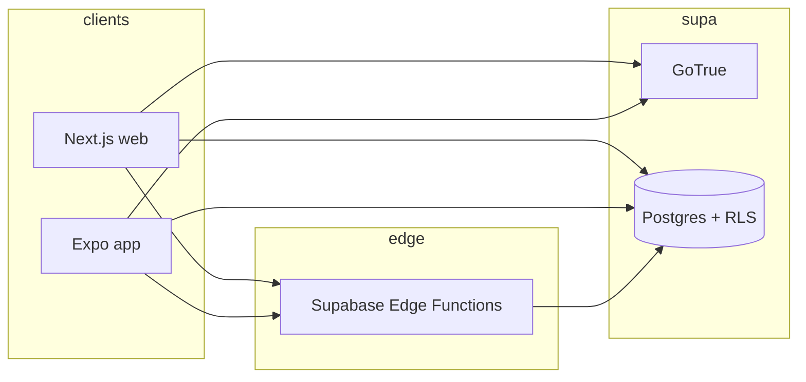

# Campsite — architecture

## Overview

Campsite is a monorepo: **Next.js** (`apps/web`) for the primary web app, **Expo** (`apps/mobile`) for iOS/Android, shared **packages** (`ui`, `theme`, `types`, `api`), and **Supabase** (Postgres + Auth + RLS + Edge Functions).

## Multi-tenancy

- **Subdomains:** `{org-slug}.campsite.app` (and `*.localhost` in dev). Middleware sets `x-campsite-org-slug`.
- **Platform admin:** `admin.campsite.app` → `/platform/*`, separate auth via `platform_admins`.
- **Data isolation:** Row Level Security on all tenant tables; `current_org_id()` derived from the signed-in user’s `profiles.org_id`.

## Data flow (high level)

## Broadcasts

- Stored in `broadcasts`; full-text search via generated `search_tsv` + `search_broadcasts()` RPC.
- **Web feed (Phase 6):** `@tanstack/react-query` with stale-while-revalidate, infinite pagination, and optional offline read queue (`broadcastReadQueue.ts`).
- Push delivery and scheduling live in Phase 2 tables (`push_tokens`, `broadcast_notification_jobs`).

## Staff discount QR

- **Mint / verify:** Edge Functions `staff-discount-token` and `staff-discount-verify` with HMAC (`_shared/staff_qr_crypto.ts`).
- **Rate limiting:** Per-org bucket via `discount_verify_increment` RPC (see function implementation).
- **Web card:** Token cached in session storage (`discountCache.ts`); QR rendered with `next/image` (data URL, `unoptimized`).

## Security

- **Headers (web):** `next.config.ts` sets `X-Frame-Options`, `X-Content-Type-Options`, `Referrer-Policy`, `Permissions-Policy`; HSTS when `VERCEL_ENV=production`.
- **Secrets:** Only anon/publishable keys in client; service role and signing secrets in Supabase/Vercel env, never in the browser.

## Mobile offline (Phase 6)

- `PersistQueryClientProvider` + AsyncStorage persister; intended query key prefixes: `broadcasts`, `rota-shifts`, `discount-qr` (wire screens to these when feeds ship).
- `NetInfo` drives TanStack `onlineManager` and the offline banner.
- **Retry queue** for mutations (e.g. read receipts) to be implemented alongside real Supabase-powered screens.

## Observability (target)

- Sentry: `@sentry/browser` + `SentryInit` on web; Expo Sentry SDK recommended for mobile (see `DEPLOY.md`).
- Uptime: hit `GET /api/health` on each deployed host.
